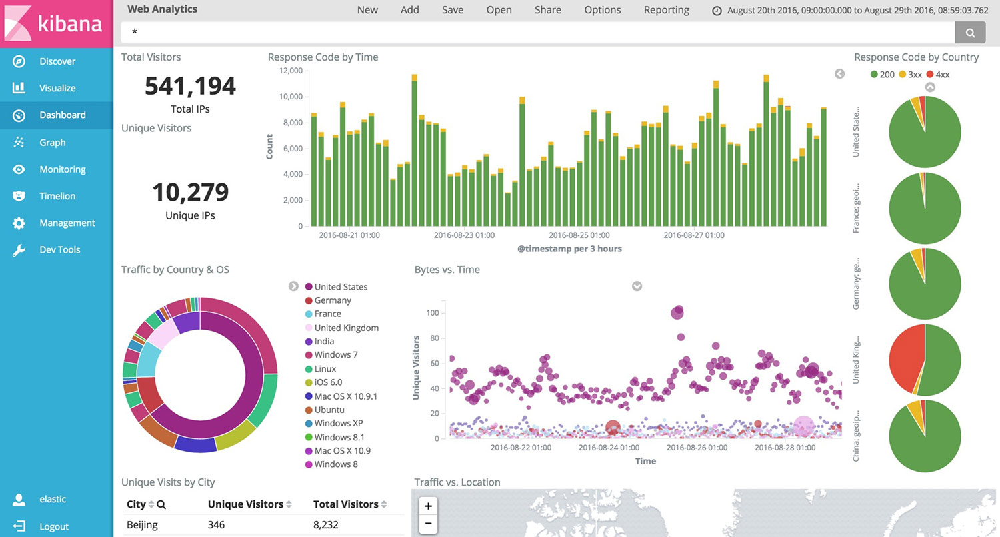

<!-- $theme: gaia -->

필요한 데이터를,
필요할 때,
얻는 방법 Elasticsearch
===

###### jaewan.huey.park@gmail.com


---

# 순서

1. 필요한 데이터?
2. 필요할 때?
3. Elasticsearch
4. 동작원리
5. 기본기능 소개
6. 실습

---

# 필요한 데이터?

- Lv1. raw 데이터
- LV2. 가공된 데이터
- Lv3. intelligence (의사결정을 도울 수 있는 정보)
- Lv4. 이해하기 쉽게

---

## Lv1

- 이번 달 패키지 판매량?
- 유저들이 가장 많이 플레이한 종족?
- DAU?

---

## Lv2

- 최근 30일간 retention?
- 상점에서 판매된 아이템의 분포?

---

## Lv3

- 이번 업데이트가 재화 전반에 걸쳐 끼친 영향?
- 유저들의 소비 성향?

---

## Lv4

- 이해하기 쉽게




---

# 필요한 데이터!

- Lv1. raw 데이터
- LV2. 가공된 데이터
- Lv3. intelligence (의사결정을 도울 수 있는 정보)
- Lv4. 이해하기 쉽게

---

# 필요할 때?

---

## 예 1 )

- 기존 컨텐츠가 고갈되어 있다고 생각함
- 새로운 컨텐츠를 업데이트가 예정되어 있음
	- 빠르게 업데이트 할 것인가?
	- 완성도를 더욱 높일 것인가?
	- 그 외의 선택지?

---

## 업데이트 이전에 필요

---

## 예 2 )

- 크리스마스 기념 이벤트를 준비하고 있음
- 유저들에게 부족한 아이템을 이벤트 상품으로 정하려고 함
	- 어떤 아이템이 부족한가?
	- 얼마나 많이 부족한가?
---

## 이벤트 이전에 필요

---

## 예 3 )

- 사장님이 매출 궁굼해 함

---

## 사장님 빡치기 이전에 필요

---

# 필요할 때!

- 의사결정이 일어나기 전
- 중요한 상황의 변화가 일어나기 전

```
데이터 확보 후
충분한 시간적 여유를
의사결정권자가 가질 수 있게 제공
```

---
